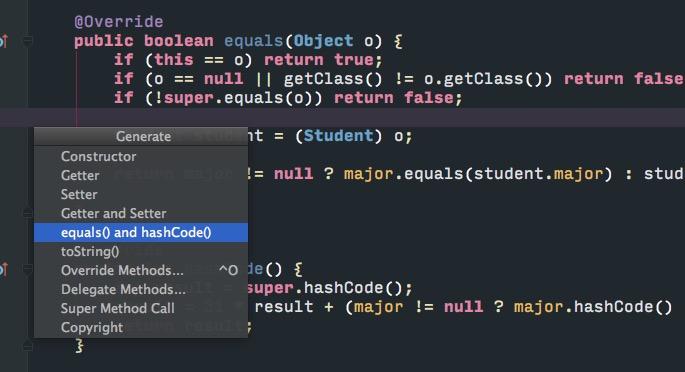

# 继承
关系:is-a(子类is-a父类)
超类,基类,父类->子类,孩子类,派生类.
在拓展超类定义子类的时候,超类应该放通用部分代码,子类需要指出与超类不同(覆盖)或者拓展更多特殊用途方法.
借助get方法访问私有域,所有数据都要private.
在子类需求与父类有所不同时,可以覆盖(override)父类.
调用父类方法时必须要用`super.方法名`,因为直接以方法名调用会默认调用本类的那个方法.
可以使用`super(P)`调用父类构造方法,使用时必须是子类构造器的第一条语句.
---
雇员方法
- 一个有参构造器
- 三个访问方法
- 一个提升工资方法
``` java
public class Employee {
    private String name;
    private Double salary;
    private Date hireDay;

    public Employee(String n,double s,int year,int mouth,int day) {
        name = n;
        salary = s;
        GregorianCalendar gregorianCalendar = new GregorianCalendar(year,mouth-1,day);
        hireDay = gregorianCalendar.getTime();
    }

    public String getName() {
        return name;
    }

    public Double getSalary() {
        return salary;
    }

    public Date getHireDay() {
        return hireDay;
    }

    public void raiseSalary(double byPercent){
        double raise = salary * byPercent/100;
        salary += raise;
    }
}
```

- 继承`Employee`
- 调用父类构造函数`super(n, s, year, mouth, day);`
- 调用父类方法`super.getSalary();`

``` java
public class Manager extends Employee {
    private double bonus;
    public Manager(String n, double s, int year, int mouth, int day) {
        super(n, s, year, mouth, day);
        bonus = 0;
    }

    @Override
    public Double getSalary() {
        double baseSalary  = super.getSalary();
        return baseSalary + bonus;
    }

    public void setBonus(double bonus) {
        this.bonus = bonus;
    }
}
```

---
# equals
`equals`要求以下特性
- 自反性,`x.equals(x) == true`
- 对称性,if `y.equals(x) == true`->`x.equals(y) == true`
- 传递性,等量变换,`x.equals(y) == true,y.equals(z) == true,->x.equals(z) == true`
- 一致性,x和y的引用没有发生变化,`x.equals(y)`返回结果不变.
- 对于非空引用x,`x.equals(null) == false`

## 关于是否采用getClass
- 如果子类拥有自己的相等概念,对称性要求强制采用`getClass`检测;
- 如果由超类决定相等概念,可以采用`instanceof`检测,可以在不同子类之间比较.

因为子类决定相等标准,子类可能有超类没有的东西,所以必须要`getClass`判断比较类是否与子类是同一个类.
如果是父类决定相等标准,并且这个标准适用所有子类,那么就没必要比较子类是否是同一个类了,可以使用`instaceof`检测,不必`getClass`检测.

## 完美equals
+ 检测object和otherObject是否引用同一对象
    * `if(this==otherObject) return true;`
+ 检测otherObject是否为null
    * `if(otherObject == null) return false;`
+ 对于检测类
    * equals在子类中语意改变
        - `if(getClass() != otherObject.getClass()) return false;`
    * 所有子类equals拥有同一语意
        - `if(!(otherObject instaceof ClassName)) returun false;`
+ 将otherObject转换为相应的类的类型变量
    * `ClassName other = (ClassName)otherObject;`
+ 对所有需要比较的域进行比较,基本数据类型使用`==`,对象使用`equals`
    * `return field1 == other.field1 && Objects.equals(field2,other.field2) ...`

---
# hashCode


**尽量保证使用对象的同一个属性来生成hashCode()和equals()两个方法。**

``` java
    @Override
    public boolean equals(Object o) {
        if (this == o) return true;
        if (!(o instanceof Student)) return false;
        if (!super.equals(o)) return false;

        Student student = (Student) o;

        return major != null ? major.equals(student.major) : student.major == null;

    }

    @Override
    public int hashCode() {
        int result = super.hashCode();
        result = 31 * result + (major != null ? major.hashCode() : 0);
        return result;
    }
```


